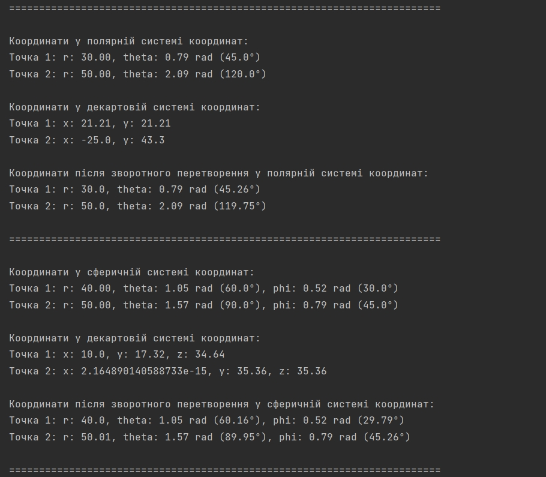

`Ярощук Александр Михайлович ИПЗ 4.04`
## CoordinateSystems

## Переход между системами координат

Для примера был сделан массив для двух точек.

После конвертации из полярной системы в декартову систему, а потом обратно в полярную, координаты точек совпали, это означает что конвертация была сделана правильно

После конвертации из сферической системы в декартову систему, а потом обратно в сферическую, координаты точек тоже совпали, это означает что для трехмерного пространства конвертация была сделана так же правильно

## Расчет расстояний в сферической системе координат

