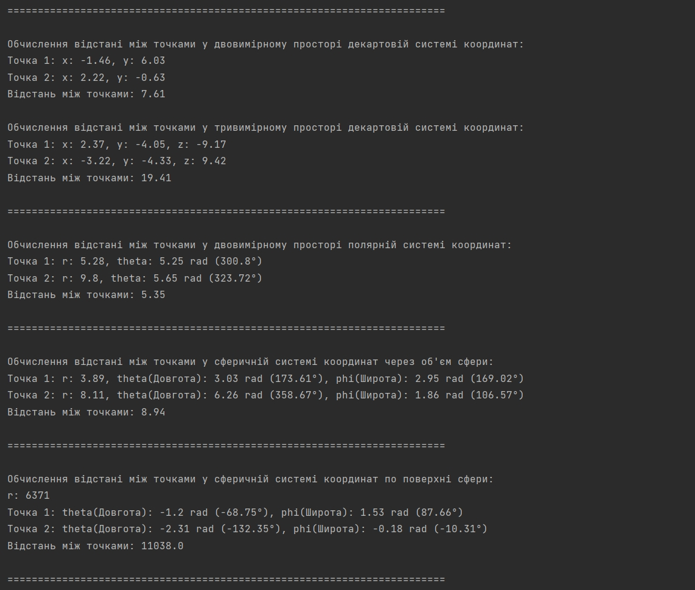
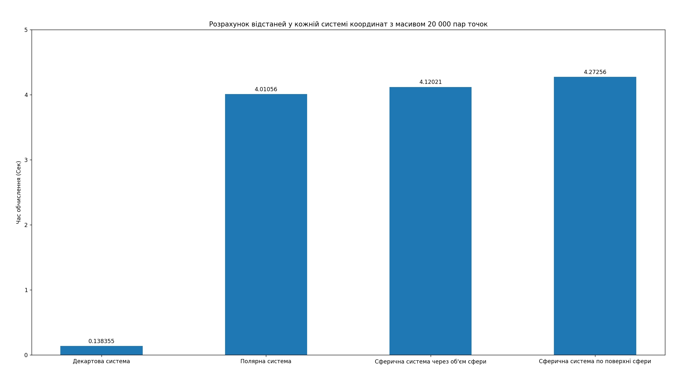

`Ярощук Александр Михайлович ИПЗ 4.04`
## CoordinateSystems

## Переход между системами координат

Для примера был сделан массив для двух точек.

После конвертации из полярной системы в декартову систему, а потом обратно в полярную, координаты точек совпали, это означает что конвертация была сделана правильно

После конвертации из сферической системы в декартову систему, а потом обратно в сферическую, координаты точек тоже совпали, это означает что для трехмерного пространства конвертация была сделана так же правильно


## Расчет расстояний в системе координат



## Бенчмарки производительности

Тесты были сделаны с массивом из 20 000 точек для:

```
Декартовой системы координат в трехмерном пространстве; 
Полярной системы координат в двухмерном пространстве;
Сферической системы координат через объем сферы в трехмерном пространстве;
Сферической системы координат по поверхности сферы в трехмерном пространстве;
```

Все результаты записаны в `result.py`

На базе этих анализов было взято среднее значение из каждой системы координат и сделан график



Как мы можем видеть самым эффективным расчетом расстояния является в декартовой системе координат.

На 2994.20% декартовая система в трехмерном пространстве эффективнее сферической системы координат по поверхности сферы в трехмерном пространстве.

Так же мы видим что сферической системы координат через объем сферы немного, но эффективнее сферической системы координат по поверхности сферы, но разница может вырасти при увеличении массива точек

Весь код находиться в папке `code/`
